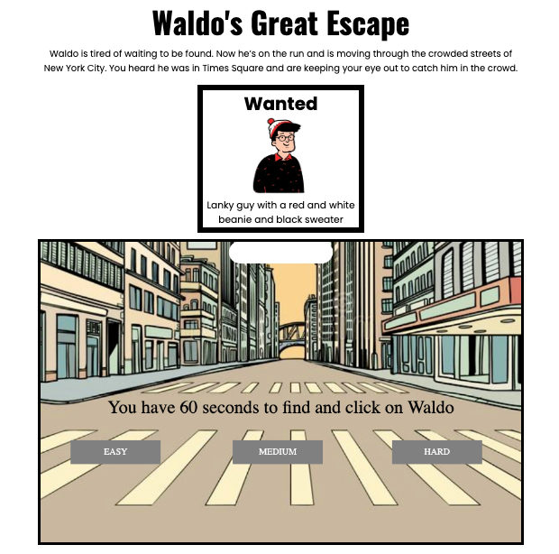

Fun game - Click link below!

[Waldo's Great Escape](https://juanedcabrera.github.io/Waldos-Great-Escape-Game/)

# Waldo's Great Escape 🏃

Waldo is tired of waiting to be found. Now he’s on the run and is moving through the crowded streets of New York City. You heard he was in Time Square and are keeping your eye out to catch him in the crowd.
Check out WaldoStory in the repository files for a full rundown.
Link here: [Waldo's Story](https://github.com/juanedcabrera/Waldos-Great-Escape-Game/blob/main/WaldoStory)

TLDR: Waldo/Wilma is designated at the top of the screen. You have 1 minute to find and click on the character. Once the timer is done if you haven’t found the character you’ll get a notification through an image. If you do you win and will get notified by an image.

*** BONUS: If you are comfortable reading code there is a secret post credit scene. After Waldo is captured and he is taken to jail, he wants to get out but needs your help. ***

## Wireframe 👀 

## Final Look 📸

## Tech Stack 💻

I used
- HTML 5: This is housing the framework for the page
- Cascading Style Sheets: This is where I am styling the headings, wanted sign, and body
- Javascript: This is where, using Canvas, I am storing all the mechanics of the game. Also controlling the messaging, click-through mechanics, and sound. 

## MVP 🏆

- Start button to start the game
- Have rect boxes move from right to left
- Have rect boxes move from left to right
- Randomize the speed of which they show
- Designate one to be “Waldo” and put the image on the screen
- Create a hitbox on the Waldo image
- Detect a click on hitbox
- Put a timer that stops the game
- If Waldo is clicked within timer display winner image, if not loser image
- Write a rule/how to play section

## Stretch Goals ⭐
- Create image assets (I think I will use Open Peeps)
- Have images move slightly up and down to mimic walking
- Randomize the images
- Create a level system that loops next number and changes attributes
- Have higher number levels increase the rows and speed of which characters are moving
- Create a browser storing system that keeps track of player records so you could see past level achieved
- Have sounds that play for the crowd moving and when you click on Waldo

## Potential Roadblocks 🚧
- TIME! - Biggest worry is that I won’t have a completed game by next the deadline. 
- HitBox Click - We went over a hitbox to detect collision but not a click event
- Canvas - This project will use a many aspects of Canvas, a new language
- Math - There will be randomization pieces that will need to be created
- Audio - This will be something that is new to me and I’m not sure how it works

## Approach  Taken
Waldo was always one of my favorite games. With this game I wanted to give the user the experience of finding and clicking Waldo without knowing the next time that he would be in the same spot. Drawing inspiration from games like Assasin's Creed, I thought it would be cool if Waldo could blend in a crowd. Using https://www.openpeeps.com/, an open source illustration library of characters, I felt I had the framework to build what I had in mind. I built out pseudocode and initial files to prepare my thought process.  When I started starting with rectangles that would initialize and move from right to left. I then added Waldo and start button so the game could start and you could click on Waldo to initialize end game process. Then I addeed a timer and put in a feature to reset the game at the end of the timer or when you clicked on Waldo. Increased number of peeps (people on the screen) and got a loop to run through the creation of the peeps. Then I added flipping of the images so the people are facing the direction they are walking. I then put the start button from in the HTML to on the Canvas and added screen messaging through the Canvas. Then I added rules, sound, and styling while also fixing bugs.

## Reflection
I think this was a very challenging project. It was not an easy game to create, required a lot of time, effort, and attention to detail to make it work properly. Throughout the development I experienced moments of frustratio, confusion, and even doubted my ability to achieve the intended outcome. These feelings often subsided when I finally got to see movement on the screen or be able to click on Waldo specifically. By facing these challenging moments I feel like I've learned new skills, gained valuable experience, and become more proficient as a developer. While this entire experience was challenging it was incredibly rewarding and made me prideful of my progress.

## Sources/Acknowledgement
- OpenPeeps.com for providing open source characters
- Sounds from PixaBay open source sounds
- [Andrew Smith](https://github.com/continentaldivide) for helping me with useful opinions on ways to move forward and bugs in my game.
- [Devin Raleigh](https://github.com/devinkr) for brainstorming with me on bug fixes and guidance.